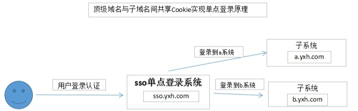

# 常见面试问题

## 单点登录

 1. 当用户访问a系统时。
 2. 先行判断$_COOKIE['ticket']是否存在。
 3. 如果不存在或者ticket不正确(注：ticket是先加密过的)时，直接跳到sso.yxh.com(header("location:http://sso.yxh.com?redirect_url=http://a.yxh.com")单点登录系统，进行登录。
4. 登录成功后，生成ticket存储到Cookie中，相应的也要存储在服务器端(存储在redis，或者session中)。
5. 然后跳回到a.yxh.com，再校验ticket，校验成功，则登录成功。
6. 如果用户需要登出，则需要清除cookie,setcookie("ticket", null, time() - 1000, "/", "yxh.com");
 7. 登出后，其他系统下的ticket也相继被清除、其他系统也相应登出。